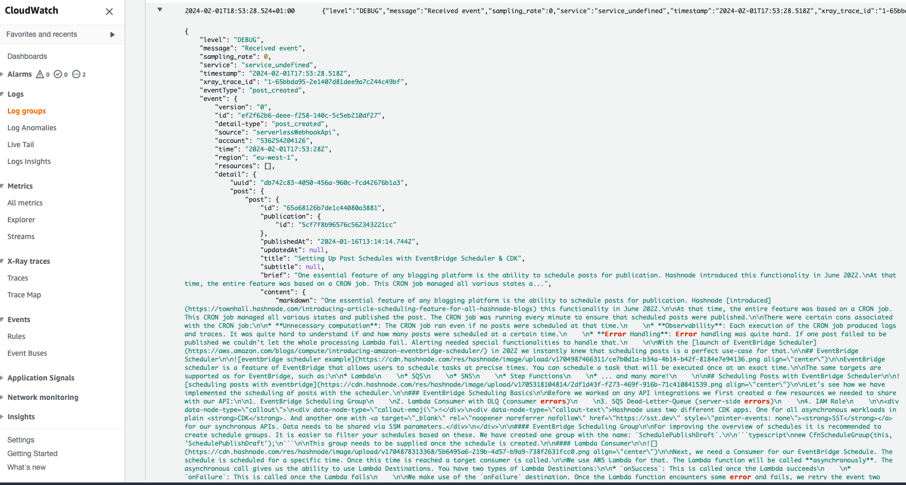

# HashBridge: extend your Hashnode blog with event-driven serverless functions

Connect your Hashnode blog to serverless AWS Lambda functions and Amazon EventBridge based on events in your Hashnode blog.

This project is explained in detail in the blog post [HashBridge: Extend your Hashnode blog with event-driven serverless functions](https://serverlesstypescript.com/hashbridge-extend-your-hashnode-blog-with-event-driven-serverless-functions), the following is a summary of the steps to get started.


## Prerequisites

- An [AWS account](https://repost.aws/knowledge-center/create-and-activate-aws-account)
- Node.js v18.x or later
- AWS CLI (*optional*)
- A Hashnode blog

### Create an Hashnode Webhook Secret

First, you need to obtain the Hashnode webhook secret. To do this, go to your blog's settings page and click on the "Webhooks" tab. Then, click on the "Add New Webhook" button.


For now, you can leave the "Webhook URL" field empty. You will get the URL later when you deploy the HashBridge application. Copy the value displayed in the "Secret" field. This value will be used to verify that the webhook request is coming from Hashnode. Make sure to leave this page open for now.

### Store the Hashnode Webhook Secret

To avoid storing the Hashnode webhook secret in your source code, you can store it in AWS Secrets Manager. It's a good practice to handle secrets this way, as it also allows you to rotate the secret without having to redeploy your application.

If you have the AWS CLI installed, you can store the webhook secret in AWS Secrets Manager by running the following command and replacing the secret value with your own:

```bash
aws secretsmanager create-secret --name hashnode/webhook-secret --secret-string="hn_whs_xxxxxxxxxxxxxxxxxxx" --region us-east-1
```

If instead you prefer to store the secret in the AWS Secrets Manager console, you can follow the steps described in the [AWS Secrets Manager documentation](https://docs.aws.amazon.com/secretsmanager/latest/userguide/manage_create-basic-secret.html). When creating the secret, make sure to use the name `hashnode/webhook-secret`.


> [!IMPORTANT]
> HashBridge deploys a number of resources into your AWS account, including a Amazon CloudFront distribution, AWS Lambda functions, and an Amazon EventBridge event bus. While the AWS Free Tier includes a number of these resources for free, you may incur charges if you exceed the free tier limits. For more information, see [AWS Free Tier](https://aws.amazon.com/free/). We also recommend you setting up a billing alarm to monitor your AWS charges. For more information, see [Creating a Billing Alarm](https://docs.aws.amazon.com/AmazonCloudWatch/latest/monitoring/monitor_estimated_charges_with_cloudwatch.html#monitor_estimated_charges_console).

## Deploy the HashBridge application

As a first step, clone this repository to your local machine:

```bash
git clone git@github.com:dreamorosi/serverless-webhook-hashnode.git
```

Next, install the dependencies:

```bash
cd serverless-webhook-hashnode
npm ci
```

Now, you can deploy the application to your AWS account by running the following command:

```bash
cdk deploy -- --all
```

After a few minutes, the deployment will complete and you will see the URL of the CloudFront distribution in the output. 

```bash
 ✅  ServerlessWebhookApiStack

✨  Deployment time: 298.98s

Outputs:
ServerlessWebhookApiStack.distribution = https://dkzum3j6x4pzr.cloudfront.net
```

Copy the URL and go back to the Hashnode settings page. Paste the URL in the "URL" field and make sure the events of type `post_*` are selected, then click on the "Save" button.

Congratulations! You have successfully deployed the HashBridge application and connected it to your Hashnode blog 🎉!

## Test the application

While the Hashnode webhook page provides a "Test" button, it doesn't allow you to test the webhook with real data from your blog.

To test the webhook, you can create a new post in your Hashnode blog. After a few seconds, you should be able to see the logs of the `consumer` Lambda function in the AWS Lambda console (more on this later).

Alternatively, we also provide a simple script that pulls a post from a blog and sends it to the webhook simulating a Hashnode webhook request. To use it, you need to first update the url to your webhook in the `src/scripts/test-webhook.mts` file:

```typescript
const BLOG_HOST = "engineering.hashnode.com";
const WEBHOOK_URL = "https://your-webhook-url.com/webhook"; // <-- Update this
```

Then, you can run the script by running the following command:

```bash
npm run test-webhook
```

Which should produce an output similar to the following:

```bash
> hashbridge-serverless-webhook-hashnode@0.1.0 test-webhook
> node -r esbuild-register src/scripts/test-webhook.mts

Event sent!
{
  "metadata": {
    "uuid": "db742c83-4050-456a-960c-fcd42676b1a3"
  },
  "data": {
    "publication": {
      "id": "5cf7f8b96576c562343221cc"
    },
    "post": {
      "id": "65a68126b7de1c44080a3881"
    },
    "eventType": "post_created"
  }
}
```

To see the logs of the `consumer` Lambda function, login to the AWS console and go to the CloudWatch console. Then click on "Logs groups" in the left menu and find the log group that starts with `/aws/lambda/ServerlessWebhookApiStack-consumerFn`. 


Click on the most recent log stream, you should see the logs of the `consumer` Lambda function:



## Extend the application

HashBridge is designed to be extended with new event handlers. To add a new event handler, you can either customize the existing consumer function or add new ones. Below we describe how to do both.

### Customize the consumer function

### Add a new consumer function

To add a new consumer function, you need to create a new Lambda function and add it to the `ServerlessWebhookApiStack` stack in the `src/ServerlessWebhookApiStack.ts` file.

As a first step you need to create the code for the new function. To do this, you can copy the `src/functions/consumer` folder and rename it to the name of your new function (e.g. `src/functions/my-new-function`). Then, you can customize the code of the function to implement the desired functionality by editing the `src/functions/my-new-function/index.ts` file.

```ts
import type { EventBridgeEvent } from "aws-lambda";
import { Logger } from "@aws-lambda-powertools/logger";
import type { EventType, PostEvent } from "./types.js"; // this file is under src/functions/consumer/types.ts

const logger = new Logger({ logLevel: "DEBUG" });

export const handler = (event: EventBridgeEvent<EventType, PostEvent>) => {
  const eventType = event["detail-type"];
  logger.debug("Received event", { eventType, event });
};
```

Next, you need to add the new function to the `ServerlessWebhookApiStack` stack. To do this, you need to add a new `NodejsFunction` construct to the stack.

For each function you need to add the following resources:

```typescript
const myNewFn = new NodejsFunction(this, "myNewFn", {
  runtime: Runtime.NODEJS_20_X,
  memorySize: 512,
  timeout: Duration.seconds(20),
  entry: join(__dirname, "./functions/my-new-function/index.ts"),
  handler: "handler",
  bundling: {
    format: OutputFormat.ESM,
    minify: true,
    esbuildArgs: {
      "--tree-shaking": "true",
    },
  },
});

const newPostEventRule = new Rule(this, "newPostEventRule", {
  eventBus: eventBus,
  eventPattern: {
    source: Match.exactString("serverlessWebhookApi"),
  },
});
newPostEventRule.addTarget(new LambdaFunction(myNewFn));
```

You can customize the pattern of the event rule to match the events you want to handle. For example, the rule above handles all the events coming from the `serverlessWebhookApi` event bus. If instead you want to handle only the `post_created` events, you can use the following pattern:

```typescript
const newPostEventRule = new Rule(this, "newPostEventRule", {
  eventBus: eventBus,
  eventPattern: {
    source: Match.exactString("serverlessWebhookApi"),
    detailType: Match.exactString("post_created"),
  },
});
```

You can find more information about the event patterns in the [Amazon EventBridge documentation](https://docs.aws.amazon.com/eventbridge/latest/userguide/eb-rules.html). 

With EventBridge you can also create rules with different targets. For example, you can create a rule that sends the event to an Amazon SQS, or even other API endpoints. For more information, see [Targets for Amazon EventBridge rules](https://docs.aws.amazon.com/eventbridge/latest/userguide/eventbridge-targets.html).

## Cleanup

To delete the resources created by the HashBridge application, you can run the following command:

```bash
npm run cdk destroy -- --all
```

This command will delete all the resources created by the application, including the CloudFront distribution, the Lambda functions, and the EventBridge event bus.

Due to a limitation in CDK, the command will fail to delete the Lambda@Edge function. This happens because the function is replicated in all the AWS regions to allow for global distribution and CDK doesn't support deleting replicated functions (yet).

To delete the function open the AWS Lambda console in the `us-east-1` region and delete all versions of the function with name starting with `ServerlessWebhookAuthStack-authAtEdgeFn`.


When you get to the last version, you will get an error message saying that the function can't be deleted because it's replicated in other regions. This means that the function is still replicated in other regions. To delete the function, you need to wait for the replication to complete. This can take up to 30 minutes.

Once the last version of the function is deleted, you can run the following command again to delete the stack:

```bash
npm run cdk destroy -- --all
```
